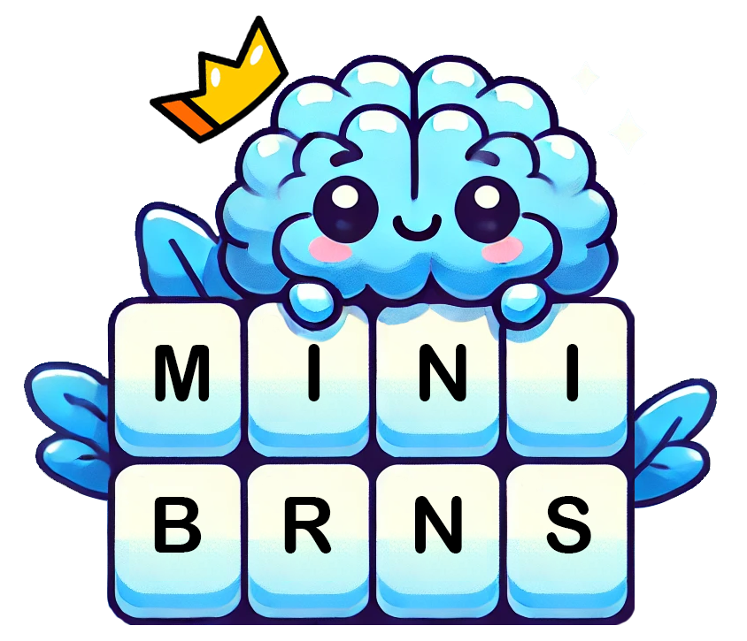

<div align="center">
  
</div>

# NYT Mini Crossword Chatbot

This project was created to help automate a family group chat where we share our New York Times Mini Crossword scores daily and track monthly and yearly winners. The group chat is called "MiniBrains," which you will see referenced throughout the codebase.

This app uses GitHub Actions to automatically check the leaderboard every day and send a GroupMe message congratulating the winner (and sometimes taunting the loser). It tracks all of our scores in a PostgreSQL database and alerts us monthly about the monthly winner, with a final message at the end of the year for the yearly winner.

We have also incorporated some custom rules, such as earning 3x points if you win on your birthday and a monthly Daily Double where the winner gets double points.

Because the NYT doesn't provide an open API for leaderboard data, this app requires you to find your `NYT-S` cookie from the NYT website. Big thanks to [@SinaKhalili](https://github.com/SinaKhalili) for discovering that workaround. It's a bit complex and may not work indefinitely, but instructions on obtaining the cookie are provided below.

## Technologies Used

- **Python**: The core language for scripting and automation.
- **SQLAlchemy**: ORM for managing and interacting with PostgreSQL.
- **PostgreSQL**: Database for storing users, scores, multipliers, and messages.
- **GitHub Actions**: Automates the scheduling and running of scripts for sending messages and performing daily, monthly, and yearly tasks.

## Prerequisites

To run this project, you will need:

- **Python 3.x**: Ensure you have Python installed on your machine.
- **PostgreSQL Database**: Set up a PostgreSQL database to store your application's data.
- **GroupMe Bot**: Create a GroupMe bot to send messages.
- **NYT Crossword Cookie**: Obtain your NYT cookie by logging into the [NYT games website](https://www.nytimes.com/crosswords), inspecting the page, and navigating to Application > Cookies to find the `NYT-S` cookie.

## Environment Variables

Set up the following environment variables in your `.env` file:

```plaintext
NYT_COOKIE='your_nyt_cookie_here'
DB_USER='your_db_user_here'
DB_PASSWORD='your_db_password_here'
DB_HOST='your_db_host_here'
DB_PORT='your_db_port_here'
DB_NAME='your_db_name_here'
GROUPME_BOT_ID='your_groupme_bot_id_here'
```

## Database Setup

You'll need to create your own database for this project using the code in `setup_database.sql`. I had ChatGPT generate ~50 messages for me for daily, monnthly, and yearly messages. I had it put `[Winner]` and `[Loser]` in the messages and prompted it to congragulate the winner and ocassionally taunt the loser.

| Table Name       | Description                                                                                                                            |
| ---------------- | -------------------------------------------------------------------------------------------------------------------------------------- |
| Users            | Stores leaderboard users. Automatically updates daily if new users join. Birthdays need to be added manually for birthday multipliers. |
| Scores           | Updates at the end of each day with players' times. Only the winner of the day gets a score; others get 0.                             |
| Daily Multiplier | Stores multipliers like birthdays and Daily Double. New entries are added on the first day of each month.                              |
| Daily Messages   | Randomized daily messages sent to announce the winner, with "Winner" and "Loser" placeholders.                                         |
| Monthly Messages | Similar to DailyMessages but sent at the end of each month.                                                                            |
| Yearly Messages  | Similar to DailyMessages but sent at the end of each year.                                                                             |

## Running locally

- **Clone the Repository:** Clone the repository and create a .env file using .envexample as a template.
- **Install Dependencies:** Run pip install -r requirements.txt to install the necessary Python packages.
- **Run Scripts Manually:** Navigate to the scripts directory and run each script directly to test locally.

## Contribution Guidelines

Contributions are welcome! To contribute:

- **Fork the repository** on GitHub.
- **Create a new branch** with a descriptive name.
- **Make your changes** and test them thoroughly.
- **Submit a pull request** to the main branch for review.
